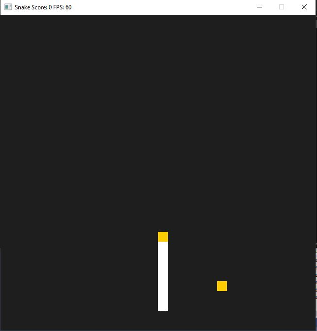

# Got-Tequila-Worm-with-Audio
Got Tequila Worm transferred away from Udacity with Audio

This is a project I developed in the Udacity C++ nano-degree. 
The readme of the original project is as follows: 

...

'(a spin-off Snake Game based on a starter repo for the Capstone project in the Udacity C++ Nanodegree Program which in turn originates in this excellent StackOverflow post and set of responses.)

It's called GOT TEQUILA WORM because you've GOT TO KILL A WORM.

Your worm loves Tequila. It is drinking itself into oblivion, dissolving into the drink it loves with every measure of the beautiful spirit. You have to help it do this. In your way will be other tequila worms who want to PARTY PARTY PARTY on your tequila. They get in the way, and are confusing (especially the drunker your worm gets).

With every drink of TEQUILA your worm gets shorter until, eventually, its body disintigrates into a blob of red blood, and you win.

Es Muerte!

Gracias!

Your score will be measured in Mexican seconds.

My major changes to Udacity's repo are:

Your worm shrivels as it drinks.
Your score is in seconds rather than length.
Other worm-bots arrive to get in the way.'

...

I wanted to get it working in my local workspace, so that I could build on it. In this case, I have added sound effects. In order to get the project running on your system, you will need the SDL2 development libraries, and to include and add the library files in the Project menu. The steps for this are in these two videos:

https://www.youtube.com/watch?v=QQzAHcojEKg

https://www.youtube.com/watch?v=x77Rbny5iBA

Moving forward, I think the project needs:
1) Artwork on the front screen (and a front screen).
2) A scoreboard.
3) If the project is to be scaled up at any stage, it will need an event queue and a stronger differentiation, through classes, of the audio system.

If you can think of anything else, please feel free to add it here, or in branched code.

Thanks,

Toby
